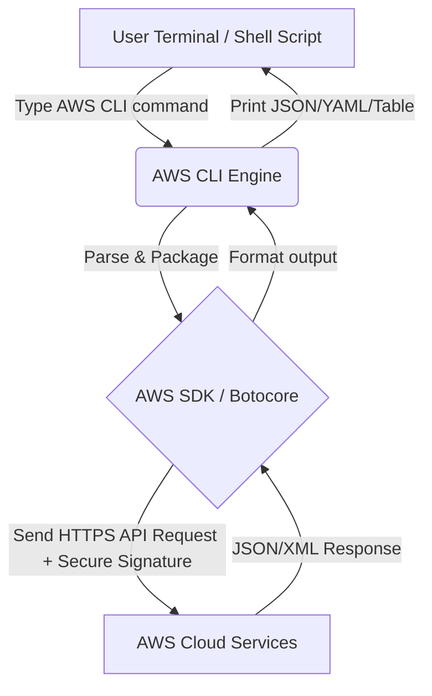

# What is AWS CLI? A Comprehensive A-Z Guide for Developers and DevOps

> \*Original post on Facebook: [AWS Study Group - Blog 1](https://www.facebook.com/groups/660548818043427/?multi_permalinks=2236217517143208&ref=share)\*

When working with Amazon Web Services (AWS), most of us start with the **AWS Management Console** - AWS's intuitive web interface. However, clicking back and forth between menus to create EC2 instances, check S3 buckets, or configure IAM permissions will soon become a "nightmare" as your project grows.

That is why the **AWS Command Line Interface (AWS CLI)** was born. It is an extremely powerful open-source tool that helps you manage all your AWS resources directly from the command line (Terminal/Command Prompt) or through automation scripts.

In this article, we will explore the power of AWS CLI (specifically **AWS CLI v2**), how to install and configure it, and the practical commands that every cloud engineer needs to know!

---

## 1. What's New and Superior in AWS CLI v2?

AWS CLI v2 is a major upgrade and is the current default version recommended by AWS. Compared to v1, this version brings many significant improvements:

*   **No local Python dependency:** In version v1, you had to install Python and manage packages via `pip` (which easily caused library conflicts). AWS CLI v2 comes as a pre-compiled binary installer for Windows, macOS, and Linux with its own integrated runtime environment.
*   **Smart Interactive Usability:**
    *   **Auto-prompt (`--cli-auto-prompt`):** Automatically suggests subcommands and parameters, and displays help documentation as you type.
    *   **Wizards:** Visual step-by-step guides for complex configuration tasks (e.g., configuring SSO connections).
*   **Native AWS IAM Identity Center (AWS SSO) support:** Helps large organizations manage secure, centralized access rather than storing static Access Keys on local machines.
*   **Flexible Output Formatting:** Easily format output as JSON, YAML, Text, or a clean Table.

---

## 2. How AWS CLI Works

Basically, AWS CLI acts as a wrapper layer on top of the **AWS SDK**.

### Mermaid Diagram:


### Diagram-as-Code (Eraser.io):
```text
// Define Groups and Nodes
Local_Machine [label: "Local Machine", color: blue] {
  User [shape: oval, icon: user, label: "User\nTerminal / Shell"]
  AWS_CLI [shape: rectangle, icon: terminal, label: "AWS CLI Engine\n- Parse args\n- Load profile & credentials"]
  AWS_SDK [shape: rectangle, icon: settings, label: "AWS SDK / Botocore\n- Build HTTP request\n- Sign SigV4"]
}

AWS_Cloud [label: "AWS Cloud", color: orange] {
  Service_Endpoint [shape: hexagon, icon: globe, label: "Service Endpoint\nec2.us-east-1..."]
  IAM_Auth [shape: rectangle, icon: lock, label: "IAM / Auth\nVerify signature"]
  AWS_Services [shape: rectangle, icon: aws, label: "AWS Services\nEC2 · S3 · Lambda"]
}

// Flow
User > AWS_CLI: 1. Run command
AWS_CLI > AWS_SDK: 2. Parse & bundle

// Requests route via Service Endpoint -> Authenticate -> Process at Service
AWS_SDK > Service_Endpoint: 3. HTTPS + SigV4
Service_Endpoint > IAM_Auth: verify signature
IAM_Auth > AWS_Services: route request

// Response from Service -> Service Endpoint -> CLI -> User
AWS_Services > Service_Endpoint: return data
Service_Endpoint > AWS_CLI: 4. JSON / XML response
AWS_CLI > User: 5. Format & print result
```

When you type a command like `aws s3 ls`, AWS CLI will:
1.  Read the configuration files (`credentials` and `config`) to get credentials.
2.  Convert the terminal command into a standard HTTPS API Request sent to the AWS endpoint (e.g., `s3.amazonaws.com`).
3.  Sign the request using the AWS Signature Version 4 algorithm.
4.  Receive the response from AWS, decode it, and display it on the screen according to the format you requested.

---

## 3. Quick Setup Guide for AWS CLI v2

Depending on the operating system you are using, run the following commands to install it:

### On Windows
Download the `.msi` installer and run it:
*   [Download AWS CLI v2 for Windows](https://awscli.amazonaws.com/AWSCLIV2.msi)
*   Or install via PowerShell (Administrator):
    ```powershell
    msiexec.exe /i https://awscli.amazonaws.com/AWSCLIV2.msi /qn
    ```

### On macOS
Install using the official package installer:
```bash
curl "https://awscli.amazonaws.com/AWSCLIV2.pkg" -o "AWSCLIV2.pkg"
sudo installer -pkg AWSCLIV2.pkg -target /
```

### On Linux
Run the script to download and extract:
```bash
curl "https://awscli.amazonaws.com/awscli-exe-linux-x86_64.zip" -o "awscliv2.zip"
unzip awscliv2.zip
sudo ./aws/install
```

> **Verify successful installation:** Run `aws --version` to confirm. You should see output like: `aws-cli/2.x.x Python/3.x.x ...`

---

## 4. Account Configuration (AWS Configure)

To allow AWS CLI to interact with your account, you need to configure credentials.

### Method 1: Using IAM Access Key (Traditional)
Run the following command and fill in the requested information (obtained from the IAM management page on the AWS Console):
```bash
aws configure
```
The system will ask you to enter:
*   `AWS Access Key ID`
*   `AWS Secret Access Key`
*   `Default region name` (e.g., `ap-southeast-1` for Singapore)
*   `Default output format` (enter `json` or `table`)

### Method 2: Using AWS IAM Identity Center (Recommended for Enterprise)
If your company manages accounts via SSO:
```bash
aws configure sso
```
Then follow the wizard instructions on the terminal to open the browser and log in.

---

## 5. Practical AWS CLI Commands Every Developer Needs to Know

The general syntax of AWS CLI is highly consistent:
```bash
aws <service> <operation> [options]
```
Here are some of the most common commands divided by service:

### 📁 Manage Amazon S3 (File Storage)
S3 CLI is very powerful because it supports commands similar to the Linux OS:

*   **List all Buckets:**
    ```bash
    aws s3 ls
    ```
*   **Upload file to S3:**
    ```bash
    aws s3 cp my-photo.jpg s3://my-bucket-name/images/
    ```
*   **Sync local directory with S3 (Only upload changed files):**
    ```bash
    aws s3 sync ./my-local-folder s3://my-bucket-name/backup/
    ```

### 💻 Manage Amazon EC2 (Virtual Servers)
*   **List running instances (filtered by state):**
    ```bash
    aws ec2 describe-instances --filters "Name=instance-state-name,Values=running" --query "Reservations[*].Instances[*].[InstanceId,InstanceType,PublicIpAddress]" --output table
    ```
*   **Start/Stop an EC2 Instance:**
    ```bash
    aws ec2 start-instances --instance-ids i-0123456789abcdef0
    aws ec2 stop-instances --instance-ids i-0123456789abcdef0
    ```

### 🔑 Check Current Identity (STS)
*   **Check which account/role you are connected with:**
    ```bash
    aws sts get-caller-identity
    ```

---

## 6. Why Should You Use AWS CLI?

1.  **Speed & Time-saving:** Type a command in 3 seconds instead of waiting 30 seconds for the web console to load and clicking 5-6 times.
2.  **Perfect Automation:** You can write Shell scripts (`.sh` or `.ps1`) to automatically backup data to S3 every night, or automatically turn off EC2 servers on weekends to save costs.
3.  **Basic Infrastructure as Code (IaC):** Helps document infrastructure creation steps instead of manual operations with no audit history.
4.  **CI/CD Integration:** Tools like GitHub Actions, GitLab CI/CD, or Jenkins all use AWS CLI to deploy applications to AWS after a successful build.

## Conclusion

**AWS CLI** is a tool that significantly increases work efficiency for any developer or DevOps engineer working with AWS. Getting familiar with the command line also opens up an automation mindset for cloud workflows. You can visit the project's GitHub repository at [github.com/aws/aws-cli](https://github.com/aws/aws-cli) to learn more.

Hope this article helps you get an overview and confidently start your AWS CLI journey!

*If you have used AWS CLI before, please share some useful tips for beginners like me by commenting below!*