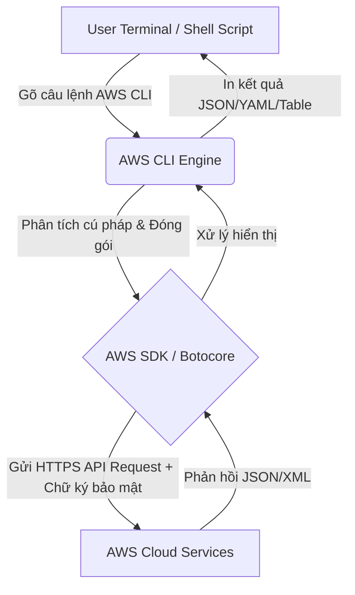

# AWS CLI là gì? Hướng dẫn toàn diện từ A-Z cho Developer và DevOps

Khi làm việc với Amazon Web Services (AWS), hầu hết chúng ta đều bắt đầu với **AWS Management Console** - giao diện web trực quan của AWS. Tuy nhiên, việc click chuột qua lại giữa các menu để tạo máy chủ EC2, kiểm tra bucket S3 hay cấu hình phân quyền IAM sẽ sớm trở thành một "cơn ác mộng" khi dự án của bạn phình to. 

Đó là lý do **AWS Command Line Interface (AWS CLI)** ra đời. Đây là một công cụ mã nguồn mở cực kỳ mạnh mẽ giúp bạn quản lý toàn bộ tài nguyên AWS trực tiếp từ dòng lệnh (Terminal/Command Prompt) hoặc thông qua các script tự động hóa.

Trong bài viết này, chúng ta sẽ cùng khám phá sức mạnh của AWS CLI (đặc biệt là phiên bản **AWS CLI v2**), cách cài đặt, cấu hình và những câu lệnh thực tế mà bất kỳ kỹ sư cloud nào cũng cần biết!

---

## 1. AWS CLI v2 Có Gì Mới Và Vượt Trội?

AWS CLI v2 là phiên bản nâng cấp lớn và là phiên bản mặc định hiện tại được AWS khuyên dùng. So với v1, phiên bản này mang lại nhiều cải tiến đáng giá:

*   **Không còn phụ thuộc vào Python local:** Ở phiên bản v1, bạn cần phải cài đặt Python và quản lý các package qua `pip` (dễ gây lỗi xung đột thư viện). AWS CLI v2 đi kèm dưới dạng file chạy nhị phân (binary) cài đặt trực tiếp cho Windows, macOS, Linux có tích hợp sẵn môi trường chạy riêng.
*   **Tính năng Tương tác Thông minh (Interactive Usability):**
    *   **Auto-prompt (`--cli-auto-prompt`):** Tự động gợi ý các lệnh con, tham số và hiển thị tài liệu hướng dẫn ngay khi bạn gõ.
    *   **Wizards:** Trình hướng dẫn từng bước trực quan cho các tác vụ cấu hình phức tạp (ví dụ: cấu hình kết nối SSO).
*   **Hỗ trợ AWS IAM Identity Center (AWS SSO) nguyên bản:** Giúp các tổ chức lớn quản lý tập trung quyền truy cập an toàn hơn, thay vì lưu trữ Access Key tĩnh trong máy cá nhân.
*   **Định dạng Output linh hoạt:** Dễ dàng định dạng kết quả trả về dưới dạng JSON, YAML, Text hoặc dạng Bảng (Table) trực quan.

---

## 2. Kiến Trúc Hoạt Động Của AWS CLI

Về cơ bản, AWS CLI hoạt động như một lớp wrapper (bao bọc) phía trên **AWS SDK**. 

### Sơ đồ Mermaid (Hiển thị trực tiếp trên GitHub/Markdown editor):


### Sơ đồ Diagram-as-Code bằng Eraser.io (Sao chép vào Eraser.io để chỉnh sửa):
```text
// Định nghĩa các Nhóm (Groups) và Node
Local_Machine [label: "Máy người dùng (Local Machine)", color: blue] {
  User [shape: oval, icon: user, label: "User\nTerminal / Shell"]
  AWS_CLI [shape: rectangle, icon: terminal, label: "AWS CLI Engine\n- Parse args\n- Load profile & credentials"]
  AWS_SDK [shape: rectangle, icon: settings, label: "AWS SDK / Botocore\n- Build HTTP request\n- Sign SigV4"]
}

AWS_Cloud [label: "AWS Cloud", color: orange] {
  Service_Endpoint [shape: hexagon, icon: globe, label: "Service Endpoint\nec2.us-east-1..."]
  IAM_Auth [shape: rectangle, icon: lock, label: "IAM / Auth\nVerify signature"]
  AWS_Services [shape: rectangle, icon: aws, label: "AWS Services\nEC2 · S3 · Lambda"]
}

// Luồng hoạt động (Flows)
User > AWS_CLI: 1. Run command
AWS_CLI > AWS_SDK: 2. Parse & bundle

// Yêu cầu đi qua Service Endpoint -> Xác thực -> Xử lý tại Service
AWS_SDK > Service_Endpoint: 3. HTTPS + SigV4
Service_Endpoint > IAM_Auth: verify signature
IAM_Auth > AWS_Services: route request

// Phản hồi từ Service -> Service Endpoint -> CLI -> User
AWS_Services > Service_Endpoint: return data
Service_Endpoint > AWS_CLI: 4. JSON / XML response
AWS_CLI > User: 5. Format & print result
```

Khi bạn gõ một câu lệnh như `aws s3 ls`, AWS CLI sẽ:
1.  Đọc file cấu hình (`credentials` và `config`) để lấy thông tin xác thực.
2.  Chuyển đổi câu lệnh terminal thành một API Request chuẩn HTTPS gửi tới endpoint của AWS (ví dụ: `s3.amazonaws.com`).
3.  Ký xác thực request bằng thuật toán Signature Version 4 của AWS.
4.  Nhận phản hồi từ AWS, giải mã và hiển thị ra màn hình theo định dạng bạn yêu cầu.

---

## 3. Hướng Dẫn Cài Đặt Nhanh AWS CLI v2

Tùy vào hệ điều hành bạn đang sử dụng, hãy chạy các lệnh sau để cài đặt:

### Trên Windows
Bạn chỉ cần tải file cài đặt `.msi` và chạy:
*   [Tải AWS CLI v2 cho Windows](https://awscli.amazonaws.com/AWSCLIV2.msi)
*   Hoặc cài qua PowerShell (Administrator):
    ```powershell
    msiexec.exe /i https://awscli.amazonaws.com/AWSCLIV2.msi /qn
    ```

### Trên macOS
Cài đặt bằng package installer chính thức:
```bash
curl "https://awscli.amazonaws.com/AWSCLIV2.pkg" -o "AWSCLIV2.pkg"
sudo installer -pkg AWSCLIV2.pkg -target /
```

### Trên Linux
Chạy script download và giải nén:
```bash
curl "https://awscli.amazonaws.com/awscli-exe-linux-x86_64.zip" -o "awscliv2.zip"
unzip awscliv2.zip
sudo ./aws/install
```

> **Kiểm tra cài đặt thành công:** Chạy lệnh `aws --version` để xác nhận. Bạn sẽ thấy kết quả dạng: `aws-cli/2.x.x Python/3.x.x ...`

---

## 4. Cấu Hình Tài Khoản (AWS Configure)

Để AWS CLI có thể tương tác với tài khoản của bạn, bạn cần cấu hình thông tin xác thực (Credentials). 

### Cách 1: Sử dụng IAM Access Key (Truyền thống)
Chạy câu lệnh sau và điền các thông tin được yêu cầu (lấy từ trang quản lý IAM trên AWS Console):
```bash
aws configure
```
Hệ thống sẽ yêu cầu nhập:
*   `AWS Access Key ID`
*   `AWS Secret Access Key`
*   `Default region name` (ví dụ: `ap-southeast-1` cho Singapore)
*   `Default output format` (nhập `json` hoặc `table`)

### Cách 2: Sử dụng AWS IAM Identity Center (Khuyên dùng cho Doanh nghiệp)
Nếu công ty bạn quản lý tài khoản qua SSO:
```bash
aws configure sso
```
Sau đó làm theo trình hướng dẫn trên terminal để mở trình duyệt và đăng nhập.

---

## 5. Những Lệnh AWS CLI Thực Tế Mà Lập Trình Viên Cần Biết

Cú pháp chung của AWS CLI cực kỳ nhất quán:
```bash
aws <service> <operation> [options]
```

Dưới đây là một số lệnh phổ biến nhất được chia theo dịch vụ:

### 📁 Quản lý Amazon S3 (Lưu trữ file)
S3 CLI rất mạnh mẽ vì nó hỗ trợ các lệnh tương tự như hệ điều hành Linux:

*   **Liệt kê tất cả các Bucket:**
    ```bash
    aws s3 ls
    ```
*   **Upload file lên S3:**
    ```bash
    aws s3 cp my-photo.jpg s3://my-bucket-name/images/
    ```
*   **Đồng bộ thư mục local với S3 (Chỉ upload các file có sự thay đổi):**
    ```bash
    aws s3 sync ./my-local-folder s3://my-bucket-name/backup/
    ```

### 💻 Quản lý Amazon EC2 (Máy chủ ảo)
*   **Xem danh sách các máy chủ đang chạy (lọc theo trạng thái):**
    ```bash
    aws ec2 describe-instances --filters "Name=instance-state-name,Values=running" --query "Reservations[*].Instances[*].[InstanceId,InstanceType,PublicIpAddress]" --output table
    ```
*   **Khởi động/Dừng một máy chủ EC2:**
    ```bash
    aws ec2 start-instances --instance-ids i-0123456789abcdef0
    aws ec2 stop-instances --instance-ids i-0123456789abcdef0
    ```

### 🔑 Kiểm tra danh tính hiện tại (STS)
*   **Kiểm tra xem bạn đang kết nối bằng tài khoản/role nào:**
    ```bash
    aws sts get-caller-identity
    ```

---

## 6. Tại Sao Bạn Nên Sử Dụng AWS CLI?

1.  **Tốc độ & Tiết kiệm thời gian:** Gõ một lệnh trong 3 giây thay vì chờ tải trang web console mất 30 giây và click 5-6 lần.
2.  **Tự động hóa hoàn hảo:** Bạn có thể viết các file Shell script (`.sh` hoặc `.ps1`) để tự động sao lưu dữ liệu lên S3 mỗi đêm, hoặc tự động tắt máy chủ EC2 vào cuối tuần để tiết kiệm chi phí.
3.  **Hạ tầng dưới dạng Code (IaC) sơ khai:** Giúp ghi chép lại các bước tạo hạ tầng thay vì thao tác thủ công không có lịch sử lưu vết.
4.  **Tích hợp CI/CD:** Các công cụ như GitHub Actions, GitLab CI/CD hay Jenkins đều sử dụng AWS CLI để deploy ứng dụng lên AWS sau khi build thành công.

## Lời Kết

**AWS CLI** là công cụ giúp gia tăng đáng kể hiệu suất làm việc cho bất kỳ lập trình viên hay kỹ sư DevOps nào làm việc với AWS. Việc làm quen với dòng lệnh còn giúp mở ra tư duy tự động hóa mọi quy trình trên đám mây. Bạn có thể ghé thăm kho mã nguồn GitHub của dự án tại [github.com/aws/aws-cli](https://github.com/aws/aws-cli) để tìm hiểu sâu hơn nhé.

Hy vọng bài viết này giúp bạn có cái nhìn tổng quan và bắt đầu hành trình chinh phục AWS CLI một cách tự tin!

*Nếu bạn đã sử dụng AWS CLI trước đó, hãy chia sẻ cho những người mới đang tìm hiểu như tôi một số tips bổ ích bằng cách bình luận bên dưới nhé!*
