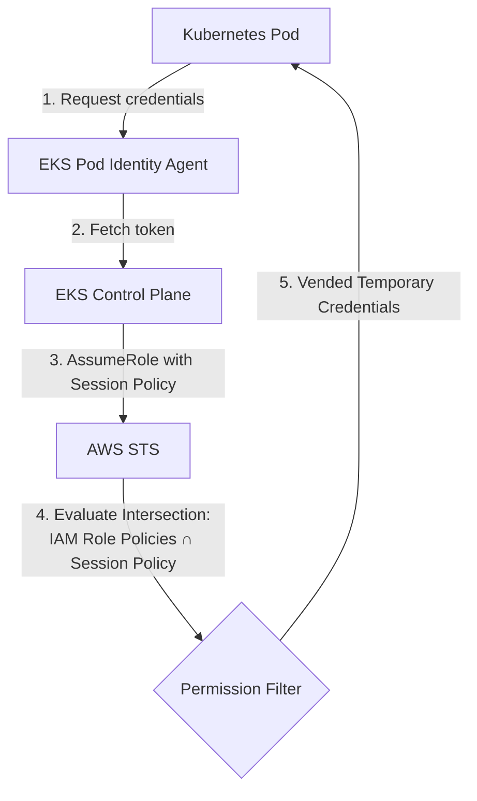

# Session Policies in Amazon EKS Pod Identity: Dynamically Scope Down Permissions at Scale

Amazon EKS Pod Identity has recently added the **session policies** feature, allowing you to narrow IAM permissions flexibly and precisely for each pod without needing to create many separate IAM roles. This is an important step forward that helps apply the principle of least privilege more effectively in large-scale Kubernetes environments.

> \*Original post on Facebook: [AWS Study Group - Blog 3](https://www.facebook.com/groups/awsstudygroupfcj/permalink/2237000000000000/)\*

---



## 1. How EKS Pod Identity Session Policies Work

A **session policy** is an inline IAM policy document in JSON format specified when creating or updating a Pod Identity association. It acts as a filter to dynamically restrict the permissions of the IAM role for the specific pod.

### Key points to know:

*   **Effective Permissions = Intersection:** The effective permissions vended to the pod are the intersection (giao) between the IAM role's permission policy and the session policy. The session policy can only narrow permissions, not expand them.
*   **Avoid Role Sprawl:** Instead of creating 10 different IAM roles for 10 pods that need slightly different access to S3 or DynamoDB, you can configure a single base IAM role and use a distinct session policy for each pod association.
*   **Account Support:** Supports both same-account and cross-account configurations (via IAM role chaining).
*   **Simple Management:** Configured directly through the AWS Management Console, AWS CLI, or AWS SDK during association setup.

### Operational Flow



---

## 2. Step-by-Step Configuration Guide

Here is how to set up session policies for your EKS pods.

### Step 1: Configure the IAM Role Trust Policy
Create an IAM role that allows the EKS Pod Identity service principal to assume the role and tag sessions. Save the following trust policy:

```json
{
    "Version": "2012-10-17",
    "Statement": [
        {
            "Effect": "Allow",
            "Principal": {
                "Service": "pods.eks.amazonaws.com"
            },
            "Action": [
                "sts:AssumeRole",
                "sts:TagSession"
            ]
        }
    ]
}
```

### Step 2: Define a Session Policy
Create a JSON file named `session-policy.json` representing the narrowed permissions. For example, to limit the pod's access to only read objects from a specific S3 bucket:

```json
{
    "Version": "2012-10-17",
    "Statement": [
        {
            "Effect": "Allow",
            "Action": [
                "s3:GetObject",
                "s3:ListBucket"
            ],
            "Resource": [
                "arn:aws:s3:::my-restricted-bucket",
                "arn:aws:s3:::my-restricted-bucket/*"
            ]
        }
    ]
}
```

### Step 3: Create the EKS Pod Identity Association
Run the `aws eks create-pod-identity-association` command and pass the session policy using the `--policy` parameter.

```bash
aws eks create-pod-identity-association \
    --cluster-name my-eks-cluster \
    --namespace production \
    --service-account application-sa \
    --role-arn arn:aws:iam::123456789012:role/my-base-pod-role \
    --policy file://session-policy.json
```

---

## 3. Crucial Limitations & Troubleshooting

While powerful, session policies come with key architectural boundaries:

> [!WARNING]
> **PackedPolicyTooLarge Error**
> AWS EKS Pod Identity compresses inline session policies, managed policy ARNs, and session tags into a packed binary format. If this combined metadata exceeds the maximum size, the API will fail with a `PackedPolicyTooLarge` error.

### How to resolve:
1.  **Simplify the Session Policy:** Keep resource paths short and combine actions where possible.
2.  **Disable Session Tags:** If session tags are not strictly required for your ABAC policies, add the `--disable-session-tags` parameter when creating or updating the association to free up significant space.
    ```bash
    aws eks create-pod-identity-association \
        --cluster-name my-eks-cluster \
        --namespace production \
        --service-account application-sa \
        --role-arn arn:aws:iam::123456789012:role/my-base-pod-role \
        --policy file://session-policy.json \
        --disable-session-tags
    ```

---

## Conclusion & Resources

Session policies represent a massive upgrade for Kubernetes security in AWS, simplifying compliance with the principle of least privilege. 

For more details, check out:
*   [AWS Containers Blog - Session policies for Amazon EKS Pod Identity](https://aws.amazon.com/blogs/containers/session-policies-for-amazon-eks-pod-identity/)
*   [Amazon EKS User Guide - Pod Identity Associations](https://docs.aws.amazon.com/eks/latest/userguide/pod-id-association.html)

*How do you plan to use Session Policies in your EKS cluster? Let us know in the comments below!*