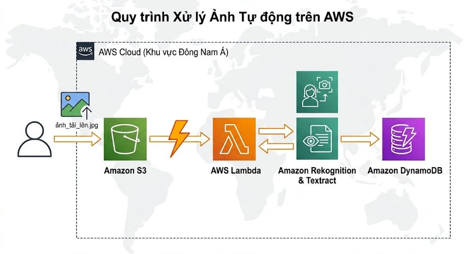
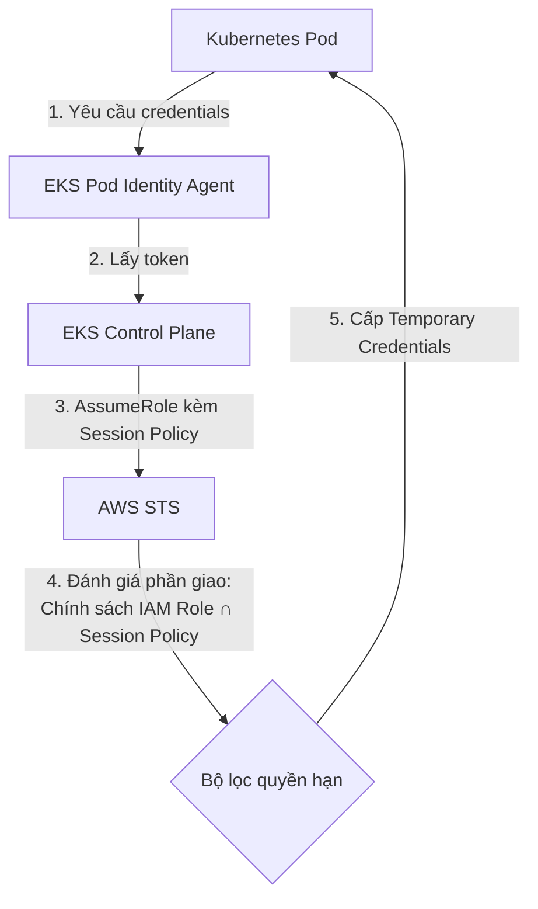

# Session Policies trong Amazon EKS Pod Identity: Thu hẹp quyền động và tinh gọn kiểm soát truy cập

Amazon EKS Pod Identity vừa bổ sung tính năng **session policies**, cho phép bạn thu hẹp quyền IAM một cách linh hoạt và chính xác cho từng pod mà không cần tạo thêm nhiều IAM roles riêng biệt. Đây là bước tiến quan trọng giúp áp dụng nguyên tắc least privilege (đặc quyền tối thiểu) hiệu quả hơn trong môi trường Kubernetes quy mô lớn.

---


## 1. Cơ chế hoạt động của Session Policies trong EKS Pod Identity

Một **session policy** là một tài liệu chính sách IAM inline (nội dòng) định dạng JSON được chỉ định khi tạo hoặc cập nhật một Pod Identity association. Nó đóng vai trò như một bộ lọc để giới hạn động các quyền của IAM role được gán cho một pod cụ thể.

### Các điểm chính cần nắm:

*   **Quyền hạn thực tế = Giao (Intersection):** Quyền hạn thực tế cấp cho pod sẽ là phần giao (intersection) giữa permissions của IAM role và session policy. Session policy chỉ có thể thu hẹp (scope down), không thể mở rộng quyền hạn.
*   **Tránh tình trạng tràn lan IAM Role (IAM Role Sprawl):** Thay vì phải tạo 10 IAM role khác nhau cho 10 pod có nhu cầu truy cập S3 hoặc DynamoDB hơi khác nhau, bạn chỉ cần cấu hình một IAM role cơ bản duy nhất và gán các session policy khác nhau cho từng association của pod.
*   **Hỗ trợ tài khoản đa dạng:** Hỗ trợ cả cấu hình cùng tài khoản (same-account) và khác tài khoản (cross-account) thông qua chuỗi liên kết IAM role (IAM role chaining).
*   **Quản lý dễ dàng:** Cấu hình trực tiếp thông qua AWS Management Console, AWS CLI hoặc AWS SDK khi thiết lập association.

### Luồng hoạt động hệ thống



---

## 2. Hướng dẫn cấu hình từng bước (Step-by-Step)

Dưới đây là các bước để thiết lập session policies cho các pod trong cluster EKS của bạn.

### Bước 1: Cấu hình Trust Policy cho IAM Role
Tạo một IAM role cho phép service principal của EKS Pod Identity assume role và gán nhãn session (tag session). Hãy lưu lại trust policy sau:

```json
{
    "Version": "2012-10-17",
    "Statement": [
        {
            "Effect": "Allow",
            "Principal": {
                "Service": "pods.eks.amazonaws.com"
            },
            "Action": [
                "sts:AssumeRole",
                "sts:TagSession"
            ]
        }
    ]
}
```

### Bước 2: Định nghĩa Session Policy
Tạo một file JSON có tên `session-policy.json` đại diện cho các quyền được thu hẹp. Ví dụ: giới hạn pod chỉ được phép đọc dữ liệu từ một bucket S3 cụ thể:

```json
{
    "Version": "2012-10-17",
    "Statement": [
        {
            "Effect": "Allow",
            "Action": [
                "s3:GetObject",
                "s3:ListBucket"
            ],
            "Resource": [
                "arn:aws:s3:::my-restricted-bucket",
                "arn:aws:s3:::my-restricted-bucket/*"
            ]
        }
    ]
}
```

### Bước 3: Tạo EKS Pod Identity Association
Chạy lệnh `aws eks create-pod-identity-association` và truyền chính sách session thông qua tham số `--policy`.

```bash
aws eks create-pod-identity-association \
    --cluster-name my-eks-cluster \
    --namespace production \
    --service-account application-sa \
    --role-arn arn:aws:iam::123456789012:role/my-base-pod-role \
    --policy file://session-policy.json
```

---

## 3. Lưu ý quan trọng & Khắc phục lỗi

Mặc dù rất mạnh mẽ, session policies cũng có những giới hạn kiến trúc cần lưu ý:

### Lỗi PackedPolicyTooLarge
AWS EKS Pod Identity nén các chính sách session inline, ARN của managed policy và các nhãn session (session tags) thành một định dạng nhị phân có giới hạn dung lượng. Nếu tổng dung lượng metadata này vượt quá giới hạn, API sẽ báo lỗi `PackedPolicyTooLarge`.

### Cách khắc phục:
1.  **Tối giản Session Policy:** Rút ngắn đường dẫn tài nguyên (resource paths) và gom nhóm các hành động (actions) nếu có thể.
2.  **Vô hiệu hóa Session Tags:** Nếu chính sách của bạn không yêu cầu sử dụng session tags cho cơ chế ABAC, hãy thêm tham số `--disable-session-tags` khi tạo hoặc cập nhật association để giải phóng một lượng lớn không gian bộ nhớ.
    ```bash
    aws eks create-pod-identity-association \
        --cluster-name my-eks-cluster \
        --namespace production \
        --service-account application-sa \
        --role-arn arn:aws:iam::123456789012:role/my-base-pod-role \
        --policy file://session-policy.json \
        --disable-session-tags
    ```

---

## Lời Kết & Tài liệu tham khảo

Session policies là một bước nâng cấp lớn cho bảo mật Kubernetes trên AWS, đơn giản hóa việc tuân thủ nguyên tắc đặc quyền tối thiểu (least privilege).

Để tìm hiểu chi tiết hơn, bạn có thể tham khảo:
*   AWS Containers Blog - Session policies for Amazon EKS Pod Identity (https://aws.amazon.com/blogs/containers/session-policies-for-amazon-eks-pod-identity/)
*   Amazon EKS User Guide - Pod Identity Associations (https://docs.aws.amazon.com/eks/latest/userguide/pod-id-association.html)

*Bạn có kế hoạch áp dụng Session Policies cho cluster EKS của mình như thế nào? Hãy để lại ý kiến dưới phần bình luận nhé!*
